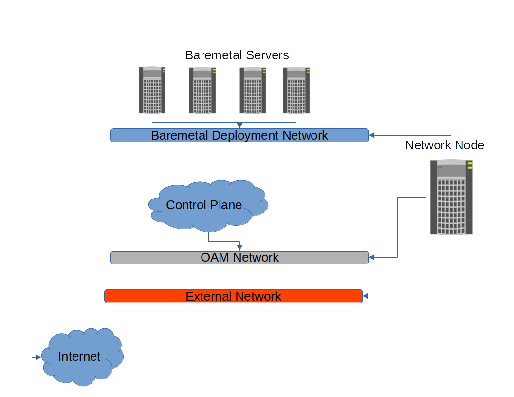
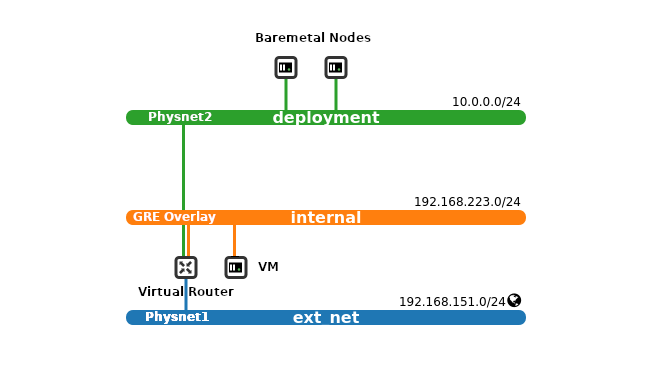

======
Ironic
======

Overview
--------

Ironic is an OpenStack project which provisions bare metal (as opposed to
virtual) machines. This document describes deploying charmed OpenStack with
Ironic. It is important to have `Upstream Ironic Documentation`_ as context.

.. note::

   Ironic is supported by Charmed OpenStack starting with OpenStack Ussuri 
   on Ubuntu 18.04.

   Currently, charmed Ironic requires Neutron OpenVSwtich as the SDN and does
   not support OVN.

Charms
~~~~~~

There are three Ironic charms:

* ironic-api (Ironic API)
* ironic-conductor (Ironic Conductor)
* neutron-api-plugin-ironic (Neutron API Plugin Ironic API)

  * SDN plugin subordinate to Neutron API

Deployment considerations
-------------------------

See `Example Bundle`_ for a known working configuration. The bundle deploys an
instantiation of nova-compute dedicated to Ironic. The ``virt-type`` is set to
'ironic' in order to indicate to Nova that bare metal deployments are available.

.. note::

   The Ironic instantiation of nova-compute does not require compute or network
   resources and can therefore be deployed in a LXD container.

.. code-block:: yaml

   nova-ironic:
     charm: cs:~openstack-charmers-next/nova-compute
     series: focal
     num_units: 1
     bindings:
       "": *oam-space
     options:
       enable-live-migration: false
       enable-resize: false
       openstack-origin: *openstack-origin
       virt-type: ironic
     to:
       - "lxd:3"

Network topology
~~~~~~~~~~~~~~~~

The primary consideration for a charmed OpenStack deployment with Ironic is the
network topology. In a typical OpenStack deployment one will have a single
provider network for the "external" network where floating IPs and virtual
router interfaces will be instantiated. Some topologies may also include an
"internal" provider network. For the charmed Ironic deployment we recommend a
dedicated provider network (i.e. physnet) for bare metal deployment. There are
other ML2 solutions that support the bare metal VNIC type. See the
*enabled-network-interfaces* setting on the ironic-conductor charm.

.. note::

   This dedicated network will not be managed by MAAS as Neutron will provide
   DHCP in order to enable Ironic to respond to bare metal iPXE requests.

In the examples below the network node will have three interfaces:

* enp1s0: OAM network (network the infrastructure is deployed on)
* enp7s0: External - physnet1
* enp8s0: Deployment - phystnet2

See the documentation in this guide for `Neutron networking deployment`_.

In the bundle the relevant settings for neutron-gateway are:

.. code-block:: yaml

   neutron-gateway
     options:
       bridge-mappings: physnet1:br-ex physnet2:br-deployment
       data-port: br-ex:enp7s0 br-deployment:enp8s0

The view from outside OpenStack will look something like:

The view from inside OpenStack will look something like:

.. note::

   Ironic conductor (in the control plane cloud above) requires network
   connectivity both to the bare metal nodes on the bare metal deployment
   network and to the power management interfaces for the bare metal nodes (not
   shown in the diagram above).

   In addition, the baremetal nodes themselves require network connectivity to
   the ironic-api to acquire metadata and the object-store (Swift or RadosGW)
   to acquire images.

Swift backend for Glance
~~~~~~~~~~~~~~~~~~~~~~~~~

In order to use the direct deployment method (see `Ironic deploy interfaces`_)
we need to have Glance store bare metal images in a Swift backend to make them
accessible by bare metal servers.

Add a relation between `glance`_ and `ceph-radosgw`_:

.. code-block:: none

   juju add relation ceph-radosgw:object-store glance:object-store

Post-deployment configuration
-----------------------------

Follow the rest of this deployment guide for the typical post-deployment
configuration. See `Configure OpenStack`_. The following is specific to Ironic.

.. note::

   The rest of this section provides an example of a bare metal setup with IPv4
   and a dedicated provider network (physnet2).

Create the bare metal deployment network
~~~~~~~~~~~~~~~~~~~~~~~~~~~~~~~~~~~~~~~~

Create the bare metal deployment network on *physnet2*.

.. code-block:: none

   openstack network create \
        --share \
        --provider-network-type flat \
        --provider-physical-network physnet2 \
        deployment

   openstack subnet create \
        --network deployment \
        --dhcp \
        --subnet-range 10.0.0.0/24 \
        --gateway 10.0.0.1 \
        --ip-version 4 \
        --allocation-pool start=10.0.0.100,end=10.0.0.254 \
        deployment

   export NETWORK_ID=$(openstack network show deployment --format json | jq -r .id)

Building Ironic images
~~~~~~~~~~~~~~~~~~~~~~

We will need three types of images for bare metal deployments: two for the iPXE
process (initramfs and kernel) and at least one bare metal image for the OS one
wishes to deploy.

Ironic depends on having an image with the ironic-python-agent (IPA) service
running on it for controlling and deploying bare metal nodes. Building the
images can be done using the `Ironic Python Agent Builder`_. This step can be
done once and the images stored for future use.

IP install prerequisites
________________________

Build on Ubuntu 20.04 LTS (Focal) or later. If ``disk-image-builder`` is run on an
older version you may see the following error:

.. code-block:: console

   INFO diskimage_builder.block_device.utils [-] Calling [sudo kpartx -uvs /dev/loop7]
   ERROR diskimage_builder.block_device.blockdevice [-] Create failed; rollback initiated

Install the ``disk-image-builder`` and ``ironic-python-agent-builder``:

.. code-block:: none

   pip3 install --user diskimage-builder ironic-python-agent-builder

Build the IPA deploy images
___________________________

These images will be used to PXE boot the bare metal node for installation.

Create a folder for the images:

.. code-block:: none

   export IMAGE_DIR="$HOME/images"
   mkdir -p $IMAGE_DIR

.. code-block:: none

   ironic-python-agent-builder ubuntu \
        -o $IMAGE_DIR/ironic-python-agent

Build the bare metal OS images
______________________________

These images will be deployed to the bare metal server.

Generate Bionic and Focal images:

.. code-block:: none

   for release in bionic focal
   do
     export DIB_RELEASE=$release
     disk-image-create --image-size 5 \
        ubuntu vm dhcp-all-interfaces \
        block-device-efi \
        -o $IMAGE_DIR/baremetal-ubuntu-$release
   done

Command argument breakdown:

* ubuntu: builds an Ubuntu image
* `vm`_: The image will be a "whole disk" image
* `dhcp-all-interfaces`_: Will use DHCP on all interfaces
* `block-device-efi`_: Creates a GPT partition table,
  suitable for booting an EFI system

Upload images to Glance
_______________________

Convert images to raw. Not necessarily needed, but this will save CPU cycles at
deployment time:

.. code-block:: none

   for release in bionic focal
   do
     qemu-img convert -f qcow2 -O raw \
        $IMAGE_DIR/baremetal-ubuntu-$release.qcow2 \
        $IMAGE_DIR/baremetal-ubuntu-$release.img
     rm $IMAGE_DIR/baremetal-ubuntu-$release.qcow2
   done

Upload OS images. Operating system images need to be uploaded to the Swift
backend if we plan to use direct deploy mode:

.. code-block:: none

   for release in bionic focal
   do
     glance image-create \
        --store swift \
        --name baremetal-${release} \
        --disk-format raw \
        --container-format bare \
        --file $IMAGE_DIR/baremetal-ubuntu-${release}.img
   done

Upload IPA images:

.. code-block:: none

   glance image-create \
       --store swift \
       --name deploy-vmlinuz \
       --disk-format aki \
       --container-format aki \
       --visibility public \
       --file $IMAGE_DIR/ironic-python-agent.kernel

   glance image-create \
       --store swift \
       --name deploy-initrd \
       --disk-format ari \
       --container-format ari \
       --visibility public \
       --file $IMAGE_DIR/ironic-python-agent.initramfs

Save the image IDs as variables for later:

.. code-block:: none

   export DEPLOY_VMLINUZ_UUID=$(openstack image show deploy-vmlinuz --format json| jq -r .id)
   export DEPLOY_INITRD_UUID=$(openstack image show deploy-initrd --format json| jq -r .id)

Create flavors for bare metal
~~~~~~~~~~~~~~~~~~~~~~~~~~~~~

Flavor characteristics like memory and disk are not used for scheduling. Disk
size is used to determine the root partition size of the bare metal node. If in
doubt, make the DISK_GB variable smaller than the size of the disks you are
deploying to. The ``cloud-init`` process will take care of expanding the
partition on first boot.

.. code-block:: none

   # Match these to your HW
   export RAM_MB=4096
   export CPU=4
   export DISK_GB=6
   export FLAVOR_NAME="baremetal-small"

Create a flavor and set a resource class. We will add the same resource class
to the node we will be enrolling later. The scheduler will use the resource
class to find a node that matches the flavor:

.. code-block:: none

   openstack flavor create --ram $RAM_MB --vcpus $CPU --disk $DISK_GB $FLAVOR_NAME
   openstack flavor set --property resources:CUSTOM_BAREMETAL_SMALL=1 $FLAVOR_NAME

Disable scheduling based on standard flavor properties:

.. code-block:: none

   openstack flavor set --property resources:VCPU=0 $FLAVOR_NAME
   openstack flavor set --property resources:MEMORY_MB=0 $FLAVOR_NAME
   openstack flavor set --property resources:DISK_GB=0 $FLAVOR_NAME

.. note::

   Ultimately, the end user will receive the whole bare metal machine. Its
   resources will not be limited in any way. The above settings orient the
   scheuduler to bare metal machines.

Enroll a node
~~~~~~~~~~~~~

.. note::

   Virutally all of the settings below are specific to one's environment. The
   following is provided as an example.

Create the node and save the UUID:

.. code-block:: none

   export NODE_NAME01="ironic-node01"
   export NODE_NAME02="ironic-node02"
   openstack baremetal node create --name $NODE_NAME01 \
        --driver ipmi \
        --deploy-interface direct \
        --driver-info ipmi_address=10.10.0.1 \
        --driver-info ipmi_username=admin \
        --driver-info ipmi_password=Passw0rd \
        --driver-info deploy_kernel=$DEPLOY_VMLINUZ_UUID \
        --driver-info deploy_ramdisk=$DEPLOY_INITRD_UUID \
        --driver-info cleaning_network=$NETWORK_ID \
        --driver-info provisioning_network=$NETWORK_ID \
        --property capabilities='boot_mode:uefi' \
        --resource-class baremetal-small \
        --property cpus=4 \
        --property memory_mb=4096 \
        --property local_gb=20

   openstack baremetal node create --name $NODE_NAME02 \
        --driver ipmi \
        --deploy-interface direct \
        --driver-info ipmi_address=10.10.0.1 \
        --driver-info ipmi_username=admin \
        --driver-info ipmi_password=Passw0rd \
        --driver-info deploy_kernel=$DEPLOY_VMLINUZ_UUID \
        --driver-info deploy_ramdisk=$DEPLOY_INITRD_UUID \
        --driver-info cleaning_network=$NETWORK_ID \
        --driver-info provisioning_network=$NETWORK_ID \
        --resource-class baremetal-small \
        --property capabilities='boot_mode:uefi' \
        --property cpus=4 \
        --property memory_mb=4096 \
        --property local_gb=25

   export NODE_UUID01=$(openstack baremetal node show $NODE_NAME01 --format json | jq -r .uuid)
   export NODE_UUID02=$(openstack baremetal node show $NODE_NAME02 --format json | jq -r .uuid)

Create a port for the node. The MAC address must match the MAC address of the
network interface attached to the bare metal server. Make sure to map the port
to the proper physical network:

.. code-block:: none

   openstack baremetal port create 52:54:00:6a:79:e6 \
        --node $NODE_UUID01 \
        --physical-network=physnet2

   openstack baremetal port create 52:54:00:c5:00:e8 \
        --node $NODE_UUID02 \
        --physical-network=physnet2

Make the nodes available for deployment
~~~~~~~~~~~~~~~~~~~~~~~~~~~~~~~~~~~~~~~

.. code-block:: none

   openstack baremetal node manage $NODE_UUID01
   openstack baremetal node provide $NODE_UUID01

   openstack baremetal node manage $NODE_UUID02
   openstack baremetal node provide $NODE_UUID02

At this point, a bare metal node list will show the bare metal machines going into a cleaning phase. If that is successful, they bare metal nodes will become ``available``.

.. code-block:: none

   openstack baremetal node list

Boot a bare metal machine
~~~~~~~~~~~~~~~~~~~~~~~~~

.. code-block:: none

   openstack server create \
        --flavor baremetal-small \
        --key-name mykey test

.. LINKS
.. _Neutron networking deployment: https://docs.openstack.org/project-deploy-guide/charm-deployment-guide/ussuri/install-openstack.html#neutron-networking
.. _Upstream Ironic Documentation: https://docs.openstack.org/ironic/latest/
.. _Example Bundle: https://github.com/thedac/openstack-bundles/blob/ironic-deployment/development/openstack-ironic-focal-ussuri/bundle.yaml
.. _Building deploy ramdisk: https://docs.openstack.org/ironic/latest/install/deploy-ramdisk.html
.. _Ironic Python Agent Builder: https://docs.openstack.org/ironic-python-agent-builder/latest/
.. _vm: https://docs.openstack.org/diskimage-builder/latest/elements/vm/README.html
.. _dhcp-all-interfaces: https://docs.openstack.org/diskimage-builder/latest/elements/dhcp-all-interfaces/README.html
.. _block-device-efi: https://docs.openstack.org/diskimage-builder/latest/elements/block-device-efi/README.html
.. _ironic deploy interfaces: https://docs.openstack.org/ironic/latest/admin/interfaces/deploy.html
.. _glance: https://charmhub.io/glance
.. _ceph-radosgw: https://charmhub.io/ceph-radosgw
.. _Configure OpenStack: https://docs.openstack.org/project-deploy-guide/charm-deployment-guide/latest/configure-openstack.html
