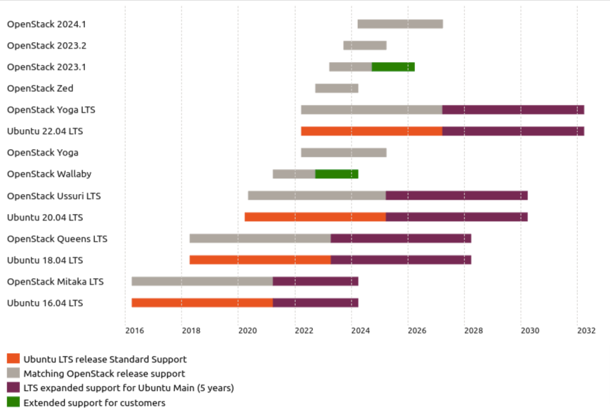

=================
Upgrades overview
=================

The purpose of the Upgrades section is to show how to upgrade Charmed OpenStack
as a whole. This page provides a summary of the involved components and how
they relate to each other. The upgrade of each of the components are distinct
operations and are referred to as separate upgrade types. They are defined in
this way:

Charms upgrade
  An upgrade of the charms that are used to deploy and manage Charmed
  OpenStack. This includes charms that manage applications which are not
  technically part of the OpenStack project such as Ceph, RabbitMQ, and Vault.

OpenStack upgrade
  An upgrade of the software deployed by the OpenStack charms. Each application
  is upgraded via its corresponding charm. This constitutes an upgrade from one
  major OpenStack version to the next (e.g. Xena to Yoga).

Series upgrade
  An upgrade of the Ubuntu operating system (e.g. Focal to Jammy) on the cloud
  nodes. This includes containers.

.. important::

   Once initiated, an upgrade type should be completed to its fullest extent
   across the cloud. Operating a cloud consisting of partially upgraded
   components is not tested nor supported.

Cloud topology
--------------

All upgrade procedures assume a specific hyperconverged cloud topology.

.. caution::

   Any deviation from the described topology may require adjustments to the
   given procedural steps. In particular, look at differences in co-located
   principal applications.

The topology is defined in this way:

* Only compute and storage charms (and their subordinates) are co-located.

* Third-party charms either do not exist or have been thoroughly tested for all
  three upgrade types.

* The following services run in LXD containers:

  * all API applications
  * the database application (percona-cluster or mysql-innodb-cluster)
  * the rabbitmq-server application
  * the ceph-mon application

* All applications, where possible, are under high availability, whether
  natively (e.g. ceph-mon, rabbitmq-server) or via hacluster (e.g.
  keystone).

Development notes
-----------------

This section includes charm development information that will better prepare
the administrator for the task of upgrading Charmed OpenStack.

* It is possible for a charm to gain new functionality that is only supported
  starting with a specific OpenStack version (e.g. gnocchi S3 support with
  Stein).

* A charm may occasionally only support a maximum or minimum series (e.g.
  percona-cluster ending with eoan and mysql-innodb-cluster starting with
  focal). This is normally due to upstream limitations (e.g Percona XtraDB
  Cluster no longer supported on Focal).

* There are two general types of charms: one that does use channels
  and one that does not (legacy). This differentiation has consequences for the
  three types of upgrades. See the :doc:`../../concepts/charm-types` page for
  an explanation.

.. note::

   A charm's limitations concerning OpenStack versions and application features
   are stated in its README file.

Software release cycles
-----------------------

Each software component has a predictable release cycle.

.. list-table:: **Software release cycles**
   :header-rows: 1
   :widths: 14 12 50

   * - Software
     - Cycle (months)
     - Schedule

   * - OpenStack Charms
     - 6
     - :doc:`../../project/release-schedule`

   * - OpenStack
     - 6
     - https://releases.openstack.org

   * - Ubuntu
     - 6
     - https://wiki.ubuntu.com/Releases

Ubuntu LTS releases
~~~~~~~~~~~~~~~~~~~

One out of every four Ubuntu releases is an LTS release (i.e. 2 year cycle).
Charmed OpenStack must be LTS-based as OpenStack upgrades are dependent upon
the `Ubuntu Cloud Archive`_ (UCA), which only supports LTS releases.

The below graphic shows the release schedule of Ubuntu LTS releases and
upstream OpenStack versions. The Ubuntu project and the OpenStack project have
deliberately synchronised their respective release cycles.

.. role:: raw-html(raw)
    :format: html

:raw-html:` `

For example, a deployment can begin on Ubuntu 20.04 LTS (that supports
OpenStack Ussuri in its default package archive) and have the ability, over
time, to upgrade OpenStack through versions V, W, X, and Y.

.. note::

   Charmed OpenStack on non-LTS Ubuntu releases is supported but should be
   considered for testing purposes only.

Upgrade order
-------------

The order in which to upgrade the different software components is critical.
The generic upgrade order is:

#. charms (to latest stable revision for the current charm type)
#. OpenStack (to latest stable version on the current series)
#. series
#. OpenStack (to desired stable version on the new series)

An upgrade type can occur without the need for it to be followed by another
upgrade type. For instance, the charms can be upgraded without the necessity of
performing an OpenStack upgrade.

However the inverse is not true: in order to achieve an upgrade type there is a
requisite upgrade type that needs to be fulfilled. For instance, in order to
upgrade a series one needs to ensure that OpenStack has been upgraded to the
most recent available version on the current series.

.. note::

   Irrespective of OpenStack or series upgrades, the charms should be upgraded
   before making topological changes to the cloud, conducting charm application
   migrations, or submitting bug reports.

Two example scenarios are provided next.

target: a specific Ubuntu release
~~~~~~~~~~~~~~~~~~~~~~~~~~~~~~~~~

* Current state: OpenStack Xena on Ubuntu 20.04 LTS
* Goal state: Ubuntu 22.04 LTS

Upgrade path:

#. Upgrade charms to latest stable revision for the current charm type
#. Upgrade OpenStack from Xena to Yoga
#. Upgrade series from focal to jammy

Final result: OpenStack Yoga on Ubuntu 22.04 LTS

target: a specific OpenStack version
~~~~~~~~~~~~~~~~~~~~~~~~~~~~~~~~~~~~

* Current state: OpenStack Ussuri on Ubuntu 18.04 LTS
* Goal state: OpenStack Victoria

Upgrade path:

#. Upgrade charms to latest stable revision for the current charm type
#. Upgrade series from bionic to focal
#. Upgrade OpenStack from Ussuri to Victoria

Final result: OpenStack Victoria on Ubuntu 20.04 LTS

Disable automatic hook retries
------------------------------

For all upgrade types it is recommended to disable automatic hook retries
within the model containing the cloud. This will prevent the charms from
attempting to resolve any encountered problems, thus providing an early
opportunity for the operator to respond accordingly.

Assuming the cloud model is the current working model turn off hook retries in
this way:

.. code-block:: none

   juju model-config automatically-retry-hooks=false

This change should normally be reverted once the upgrade is completed.

Next steps
----------

Each upgrade type is broken down into more detail on the following pages:

* :doc:`charms`
* :doc:`openstack`
* :doc:`series`

.. LINKS
.. _Ubuntu Cloud Archive: https://wiki.ubuntu.com/OpenStack/CloudArchive
