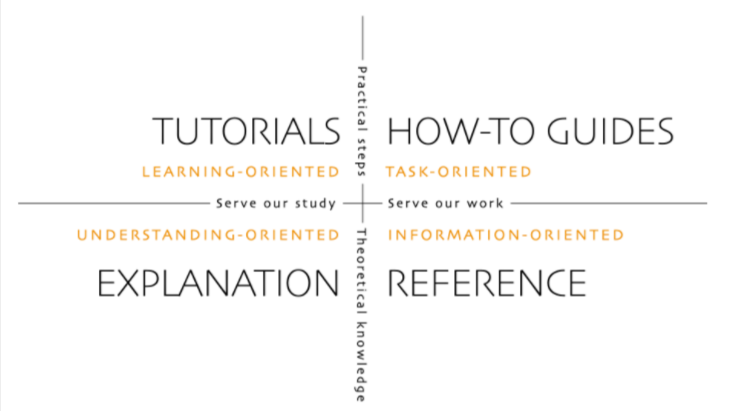

==================
Adding new content
==================

When software is developed certain documentation criteria must be met in order
for the software to be considered feature complete. And like software, a
documentation contribution must be implemented correctly.

The practice of modelling one's contribution on existing pages can be
counter-productive as the documentation set may not always be in an ideal
state. Therefore, first establish *what* you want to add and then, based on the
available sources, determine *where* to place it and *how* to do so.

There is a logical order to this document's contents. Please go through it
sequentially.

Diátaxis
~~~~~~~~

The `Diátaxis framework`_ is used throughout the documentation wherever
appropriate. It provides a conceptual approach to writing, which in turn
affects how documentation is created and how a set of pages is organised.
Becoming familiar with Diátaxis is the first step to contributing.

   The four quadrants of Diátaxis

.. note::

   Charmed OpenStack documentation prefers the term "Concepts" in the place of
   "Explanations".

Further reading: a `conference talk`_ - PyCon Australia 2017

Monolithic vs distributed
~~~~~~~~~~~~~~~~~~~~~~~~~

Now that the Diátaxis framework is understood we can consider what form a
contribution can take. It should be clear that a contribution need not be a
monolithic piece of work; it can be distributed. For instance, on the same
general topic, there can be several interconnected parts such as a conceptual
treatment, a howto guide, and a tutorial. Speak to colleagues, discuss with
your local documentarian, or chat on the user forum.

Sources
~~~~~~~

Assuming that the specific pieces of work have been identified they each need
to be published in the appropriate location, with the right tools, and in the
correct format. The following sub-sections provide an outline of each
documentation source. A :ref:`summary <doc_sources_summary>` of these sources
is given on the parent page.

OpenStack Charm Guide
^^^^^^^^^^^^^^^^^^^^^

The `OpenStack Charm Guide`_ is the main source of information for the
OpenStack Charms project. All Diátaxis types are therefore appropriate:
Tutorials, Howtos, Concepts, and Reference. The Charm Guide also includes
community and project information - categories that fall outside of the
Diátaxis framework.

This documentation is created on `OpenDev`_, is under version control (Git),
and is written in `Sphinx-enhanced reStructuredText`_.

OpenStack Charms Deployment Guide
^^^^^^^^^^^^^^^^^^^^^^^^^^^^^^^^^

The `OpenStack Charms Deployment Guide`_ is the main source of information for
the charm-by-charm deployment of a Charmed OpenStack cloud. Due to its focussed
nature, the only suitable Diátaxis type is Howtos.

This documentation is created on OpenDev, is under version control (Git), and
is written in Sphinx-enhanced reStructuredText.

.. note::

   The Deploy Guide is currently in the process of migrating non-deployment
   related content to the Charm Guide.

OpenStack Charms Admin Guide
^^^^^^^^^^^^^^^^^^^^^^^^^^^^

The `OpenStack Charms Admin Guide`_ is the day-2 operations guide for Charmed
OpenStack. Due to its focussed mandate, the only applicable Diátaxis type is
Howtos.

This documentation is created on OpenDev, is under version control (Git), and
is written in Sphinx-enhanced reStructuredText.

.. note::

   The Admin Guide is currently embedded in the Charm Guide. The intention is
   to eventually break it out into a separate guide.

Charm READMEs
^^^^^^^^^^^^^

A charm README file specifically encapsulates a charm's purpose and usage
(Diátaxis is not applied).

In order to maintain a consistent structure across all charms, a :doc:`README
template <../software-contrib/charm-readme-template>` has been made available
and should be followed.

This documentation is created on OpenDev, where each charm has its own
repository (see `OpenStack charms`_), and is written in Markdown. A README also
gets rendered on the its charm's landing page in the `Charmhub`_ (with the
`Mistune`_ Python parser). See the `keystone charm`_ for an example.

.. tip::

   The rendering of a README (into HTML) can be validated with a `Markdown
   viewer`_.

Charm developer documentation
^^^^^^^^^^^^^^^^^^^^^^^^^^^^^

Charm developer documentation is written by developers and for developers. It
may include topics such as how to build, enhance, test, or debug a charm.
Conceptual documentation that explains the inner workings of a charm is another
possibility. Suggested Diátaxis types are Howtos and Concepts.

This documentation is created in Discourse (essentially CommonMark) and is
viewed in the Charmhub. See the `keystone charm Docs tab`_ for an example.

Writing style
~~~~~~~~~~~~~

Please use the :doc:`styleguide` when creating content. Documentation is more
clearly understood by users and developers alike when it is implemented in a
consistent manner.

Technical accuracy
~~~~~~~~~~~~~~~~~~

The contribution needs to be technically correct. In particular, if the content
is a Howto or a Tutorial then the collection of steps must be tested and
verified.

.. LINKS
.. _Docs as Code: https://www.writethedocs.org/guide/docs-as-code
.. _Diátaxis framework: http://diataxis.fr
.. _conference talk: https://youtu.be/t4vKPhjcMZg
.. _OpenStack Charm Guide: https://docs.openstack.org/charm-guide
.. _OpenStack Charms Deployment Guide: https://docs.openstack.org/project-deploy-guide/charm-deployment-guide
.. _OpenStack Charms Admin Guide: https://docs.openstack.org/charm-guide/latest/admin
.. _OpenStack charms: https://opendev.org/openstack?q=charm&tab=&sort=recentupdate
.. _Charmhub: https://charmhub.io
.. _Markdown viewer: https://jbt.github.io/markdown-editor
.. _Mistune: https://mistune.readthedocs.io/en/latest
.. _keystone charm Docs tab: https://charmhub.io/keystone/docs
.. _keystone charm: https://charmhub.io/keystone
.. _OpenDev: https://opendev.org
.. _Sphinx-enhanced reStructuredText: https://www.sphinx-doc.org/en/master/usage/restructuredtext/index.html
.. _CommonMark: https://spec.commonmark.org
