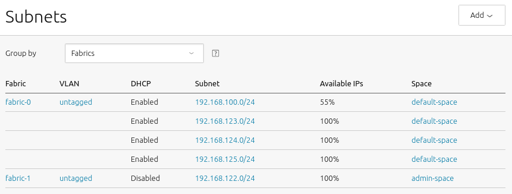

==============
Network spaces
==============

Overview
--------

This document provides a conceptual overview of the role that Juju network
spaces play in the deployment and management of Charmed OpenStack.

A network space is a Juju object that abstracts away the `OSI`_ Layer 3 network
concepts. A space is created on the backing cloud to represent one or more
subnets. The purpose of a space is to allow for user-defined network traffic
segmentation, which can have various uses (e.g. traffic isolation as a security
measure).

.. note::

   See the `Juju documentation`_ to fully explore spaces themselves.

Spaces support
--------------

For Charmed OpenStack, the recommended Juju backing cloud is MAAS. Spaces can
be created and configured within MAAS and the Juju operator can immediately
make use of them when deploying or configuring OpenStack applications.

This is a screenshot of the MAAS web UI showing an example spaces
configuration:

.. role:: raw-html(raw)
    :format: html

:raw-html:` `

In the above, we see that VLANs are used to associate spaces with subnets. It
is also clear that multi-subnet spaces are supported.

Bindings
--------

A space is associated with an application's traffic type via the latter's
corresponding "endpoint". This association is known as a "binding". This
specific traffic flow is established once the endpoint is "integrated" with
another application's endpoint (the :command:`juju integrate` command).

.. note::

   Integration is the process of connecting compatible endpoints (same
   interface type) between two applications. Endpoints are discerned from a
   charm's ``metadata.yaml`` file.

Extra bindings
~~~~~~~~~~~~~~

Juju has the notion of an "extra binding". Like a normal binding, an extra
binding requests, via spaces, that a machine be provisioned with network
connectivity to specific subnets. The intention is that the charm that supports
the binding will then configure its payload service, whose consumer may be
external to Juju, to listen on a certain IP address(es). This type of binding
is not dependent upon an integration with another application's endpoint.

.. note::

   Extra bindings are explicitly declared in a charm's ``metadata.yaml`` file.

Default space
-------------

A default value for spaces can be set at the model level and at the application
level. This value must be known to Juju (see the :command:`juju list-spaces`
command).

A model's default space is defined with the :command:`juju model-config`
command. If left unset, the system default of 'alpha' is used.

.. code-block:: none

   juju model-config -m <model> default-space=<space>

.. note::

   The :command:`juju model-default` command can be used to affect all future
   models.

A space is defined at the application level at deploy time (:command:`juju
deploy`). This becomes the application's de facto default space. That is, any
scale out operation (:command:`juju add-unit`) will inherit this value and any
further integrations for the application will also use this value.

.. note::

   It has been reported that the default space at the model level does not work
   for LXD containers. This issue is being tracked in `LP #1883164`_.

Deploying to a space
--------------------

When deploying an application, the ``--bind`` option is used with the
:command:`juju deploy` command to explicitly select a space:

.. code-block:: none

   juju deploy --bind <space> <charm>

The default space will be attempted if no space is specified. However the
absence of a machine attached to system default space ('alpha') will not
prevent a machine from being randomly provisioned.

Spaces as a constraint
----------------------

With the MAAS provider (backing cloud) the deployment of the initial unit can
refer to a space as a Juju constraint. This simply ensures that the resulting
machine has a network interface on a certain subnet(s). It is not used by the
charm to implement any network functionality, as does a normal or extra
binding:

.. code-block:: none

   juju deploy --constraints spaces=<space> <charm>

Such a constraint can be used in combination with a binding (using different
space values naturally):

.. code-block:: none

   juju deploy --constraints spaces=<space-1> --bind <space-2> <charm>

LXD containers
~~~~~~~~~~~~~~

There is a subtle distinction between applying space constraints to LXD
containers as opposed to bare metal or KVM-based MAAS nodes. For the latter
types, a constraint represents a network criterion, whereas for
dynamically-provisioned containers, a constraint acts as a request to add
network connectivity. The LXD host must also be able to satisfy that request in
terms of its own network connectivity.

Subordinate applications
------------------------

A subordinate application always runs alongside a principal application and is
only actually deployed when an integration is formed with its principal. Owing
to this behaviour, the chosen bindings of a subordinate application must be a
subset of the bindings of the principal application.

Multi-subnet spaces and routing
-------------------------------

A binding (or extra binding) should be seen as a request to allocate traffic to
certain subnets if possible, and not as a mechanism that alters or verifies
routing at the L3 level. In the case of a multi-subnet space, this implies that
network connectivity among those subnets must exist externally to Juju. There
are two key scenarios to watch out for when a multi-subnet space is involved:

* multi-unit applications
* any two integrated applications

In each of the above scenarios, inter-subnet routing must be configured in
advance to allow for the application units to reach one another. In other
words, all subnets/VLANs within the same space are assumed to have unrestricted
traffic. It should also be noted that an integration formed between two
applications is not indicative of successful routing.

Working with integrations and bindings
--------------------------------------

This section will apply many of the learned concepts to an example scenario:
that of deploying Vault and connecting it to the cloud database as described in
`the Vault section`_ of the Deploy Guide.

The metadata.yaml file
~~~~~~~~~~~~~~~~~~~~~~

Inspecting the ``metadata.yaml`` file for charms allows us to better understand
how integrations and binding are formed. The pertinent contents of this file
for the vault, mysql-router, and mysql-innodb-cluster charms will be shown.
The following YAML keys are of interest:

* ``extra-bindings``
* ``provides``
* ``requires``

This results in the following excerpts for each charm:

.. tabs::

   .. group-tab:: vault

      .. code-block:: yaml
         :linenos:

         extra-bindings:
           access:
           external:

         provides:
           nrpe-external-master:
             interface: nrpe-external-master
             scope: container
           secrets:
             interface: vault-kv
           certificates:
             interface: tls-certificates

         requires:
           db:
             interface: pgsql
           shared-db:
             interface: mysql-shared
           etcd:
             interface: etcd
           ha:
             interface: hacluster
             scope: container
           lb-provider:
             interface: loadbalancer
             limit: 1

   .. group-tab:: mysql-router

      .. code-block:: yaml
         :linenos:

         provides:
           shared-db:
             interface: mysql-shared
             scope: container

         requires:
           juju-info:
             interface: juju-info
             scope: container
           db-router:
             interface: mysql-router

   .. group-tab:: mysql-innodb-cluster

      .. code-block:: yaml
         :linenos:

         provides:
           shared-db:
             interface: mysql-shared
           db-router:
             interface: mysql-router
           db-monitor:
             interface: mysql-monitor
             scope: container
           prometheus:
             interface: http

Manual commands
~~~~~~~~~~~~~~~

This section shows example commands that can be used to manually achieve the
example scenario's objective.

It is assumed that:

* there are two spaces available to the MAAS cluster ('public-space' and
  'access-space')
* a default space is not configured at the model level
* a cloud database is pre-existing (the mysql-innodb-cluster application)

To deploy the vault application and set its default space to 'public-space':

.. code-block:: none

   juju deploy --bind public-space --to lxd:3 --channel 1.8/stable vault

To deploy the mysql-router application:

.. code-block:: none

   juju deploy --channel 8.0/stable mysql-router vault-mysql-router

To integrate the ``db-router`` endpoint of the vault-mysql-router application
(lines 10-11 of the mysql-router excerpt) with the ``db-router`` endpoint of
the mysql-innodb-cluster (lines 4-5 of the mysql-innodb-cluster excerpt)
application:

.. code-block:: none

   juju integrate vault-mysql-router:db-router mysql-innodb-cluster:db-router

To integrate the ``shared-db`` endpoint of the vault application (lines 17-18
of the vault excerpt) with the ``shared-db`` endpoint of the vault-mysql-router
(lines 2-3 of the mysql-router excerpt) application:

.. code-block:: none

   juju integrate vault-mysql-router:shared-db vault:shared-db

The ``shared-db`` endpoint traffic will now be confined to space
'public-space'.

.. note::

   Regardless of the common name of the two endpoints in each of the above
   integrations (endpoints are generally different), it is technically the
   common interface type that makes an integration possible. For the first
   integration it is ``mysql-router``, and for the second it is
   ``mysql-shared``.

To form a binding between the ``access`` endpoint (line 2 of the vault excerpt)
and the 'access-space' space:

.. code-block:: none

   juju bind vault access=access-space

An integration is not necessary for the ``access`` endpoint due to it being
associated with an extra binding.

The corresponding LXD host (Vault has been deployed to a container) must have
connectivity to the 'access-space' space in order for this to work.

The bundle method
~~~~~~~~~~~~~~~~~

The entire example deployment can be expressed in a bundle file and then used
to fulfil the goal of the example scenario. Let this file be named
``vault-to-database.yaml``:

.. code-block:: yaml

   machines:

     '3':

   applications:

     vault-mysql-router:
       charm: mysql-router
       channel: 8.0/stable

     vault:
       charm: vault
       channel: 1.8/stable
       num_units: 1
       bindings:
         "": public-space
         access: access-space
       to:
       - lxd:3

   relations:

   - - vault-mysql-router:db-router
     - mysql-innodb-cluster:db-router
   - - vault:shared-db
     - vault-mysql-router:shared-db

To use the bundle:

.. code-block:: none

   juju deploy ./vault-to-database.yaml

.. LINKS
.. _OSI: https://en.wikipedia.org/wiki/OSI_model
.. _Juju documentation: https://juju.is/docs/juju
.. _the Vault section: https://docs.openstack.org/project-deploy-guide/charm-deployment-guide/latest/install-openstack.html#vault

.. BUGS
.. _LP #1883164: https://bugs.launchpad.net/juju/+bug/1883164
